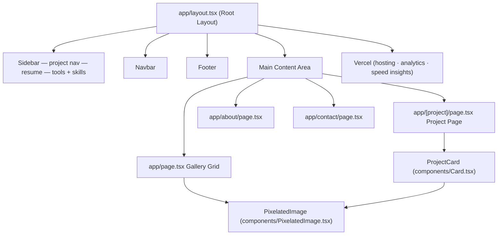

# Nina Rhone — Portfolio

Personal portfolio site for Nina Rhone, Creative Technologist and AI Solutions Architect at GUESS Inc. (MIT 2023).

Showcases commission and personal projects spanning AI/ML, web development, and creative technology.

## Architecture

## Stack

- Next.js (App Router) + TypeScript
- Tailwind CSS
- Geist font
- Vercel (hosting, analytics, speed insights)
